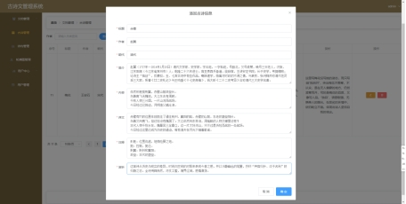

# 简介

本网站是根据在线学习的这种现状,提出解决问题的一个可行性方法：采用spring boot+mybatis技术，实现了管理和浏览古代诗歌和文章的系统，各类信息有序地进行存储，可进入系统主控界面，进行信息管理，信息查询等功能的使用。实现了各种业务系统的数据集成和信息集成，对学习文章各类信息、资源进行协同集中管理。

### 前端地址传送

[AKvtion/Gushiproject-v2 (github.com)](https://github.com/AKvtion/Gushiproject-v2)

### 技术

#### 前端
| 技术  |                                      简介                                       |
|:---:|:-----------------------------------------------------------------------------:|
| vue |                      Vue是一套用于构建用户界面的渐进式框架，它可以轻松地实现组件化开发。                      |
| axios |                  Axios是一个基于Promise的HTTP客户端，可以用在浏览器和Node.js中。                  |
| Element-UI |               Element-UI是一套基于Vue.js 2.0的桌面端组件库，提供了丰富的UI组件和交互方式。               |
| vue-router |           Vue-Router是Vue.js官方的路由管理器，它和Vue.js核心深度集成，可以非常方便地实现单页应用程序。           |

#### 后端
| 技术  |                                              简介                                             |
|:---:|:-------------------------------------------------------------------------------------------:|
| springboot |                Spring Boot是由Pivotal团队提供的全新框架，其设计目的是用来简化新Spring应用的初始搭建以及开发过程。                |
| mybatis |                           Mybatis是一款优秀的持久层框架，它支持定制化SQL、存储过程以及高级映射。                          |
| sa-token |                   Sa-Token是一个轻量级Java权限认证框架，支持多种认证方式，如JWT、Session、Cookie等。                   |
| mysql |                              MySQL是一种关系型数据库管理系统，广泛应用于Web应用程序中。                              |
| maven |                         Maven是一个项目管理和构建自动化工具，可以帮助开发者更方便地管理和构建Java项目。                        |
| swagger |                       Swagger是一种RESTful API文档生成工具，可以帮助开发者更方便地生成API文档。                       |
| hutool |                               Hutool是一个Java工具包，提供了很多常用的工具类和方法。                              |
| lombok |                                             Lombok是一个Java库，可以通过注解的方式来简化Java代码。|

### 系统架构图

### 效果图

